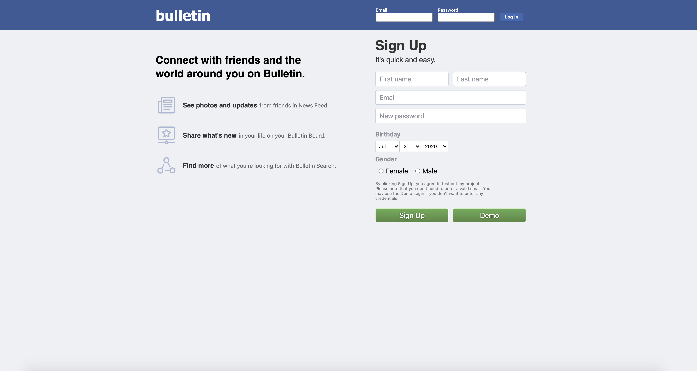
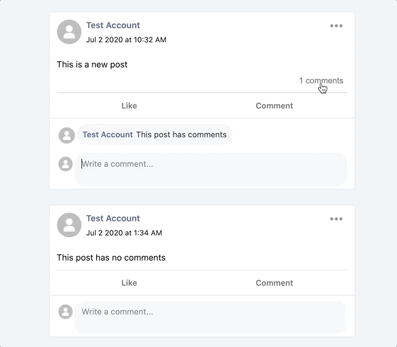

# Bulletin

Bulletin is a [Facebook](https://www.facebook.com/) clone, that allows users to create their own personalized bulletin board where they can make posts, and add friends to interact with other users.

Click [here](https://my-bulletin.herokuapp.com/) to check it out!

[](https://my-bulletin.herokuapp.com/)


## Technologies
Bulletin utilizes Heroku, PostGreSQL, React, Redux, and Ruby on Rails.

## Features
### User Authentication
- Users must login or signup in order to use Lookbook's features.


### Posts
- Posts with comments have the ability to hide and show the comments section.



### Comments
- Clicking the comment button will anchor the page to the input field, and focus it.


## Code Snippets
When users hover over comments they made, a button will appear on the side that will open a dropdown menu to allow editing and deleting.
If the user is currently editing a comment, the button will disappear, and the menu will automatically close.
```jsx
triggerMenu(state) {
    if (state) {
      this.setState({ showMenu: state })
    } else {
      this.setState({ showMenu: state, showDropdown: state })
    }
  }

triggerDropdown(state) {
  this.setState({ showDropdown: state });
}
```
```jsx
<div className="comment-item container"
onMouseEnter={
  () => {
    if (!this.state.edit) {
      this.triggerMenu(true);
    }
  }
}
onMouseLeave={
  () => {
    if (!this.state.edit) {
      this.triggerMenu(false);
    }
  }
}
>
```
```jsx
<div className={`comment-menu ${comment.id} container`}>
  <div
    className={
      `comment-menu ${comment.id} dropdown-button icon ${showMenu}`
    }
    onClick={this.handleClick}
  >
    <ul className={
      `comment-menu ${comment.id} dropdown-list ${showDropdown}`}
    >
      { editButton }
      { deleteButton }
    </ul>
  </div>
</div>
```

## Future Direction
### Profiles
- Users will have personal profile pages.
- Displays posts made on their bulletin board.
- Displays profile picture, and intro.
### Images
- Integrate with AWS to host images.
- Users can post photos, and upload profile pictures.
### Friend Requests
- Users can add friends.
### Likes
- Users can like a post, comment, or photo.
### Notifications
- Users receive notifications for received friend requests.
### Messaging 
- Users can message friends with live chat.

